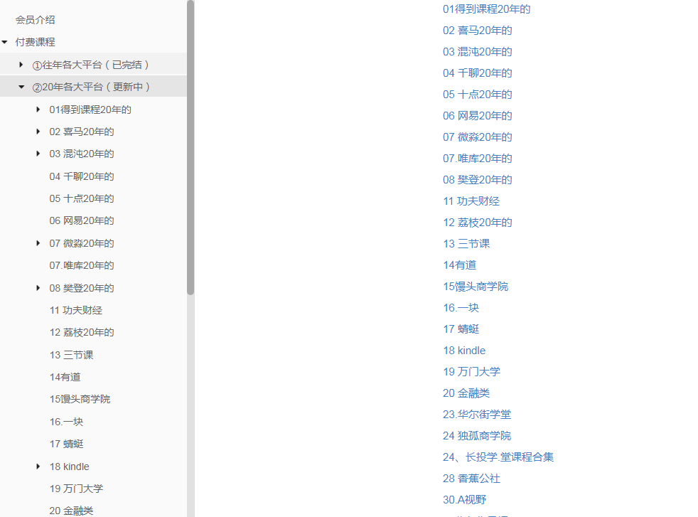
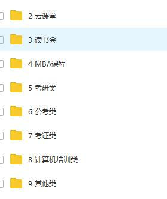
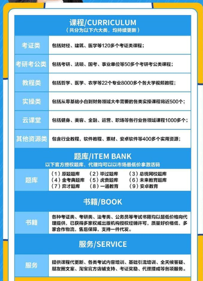
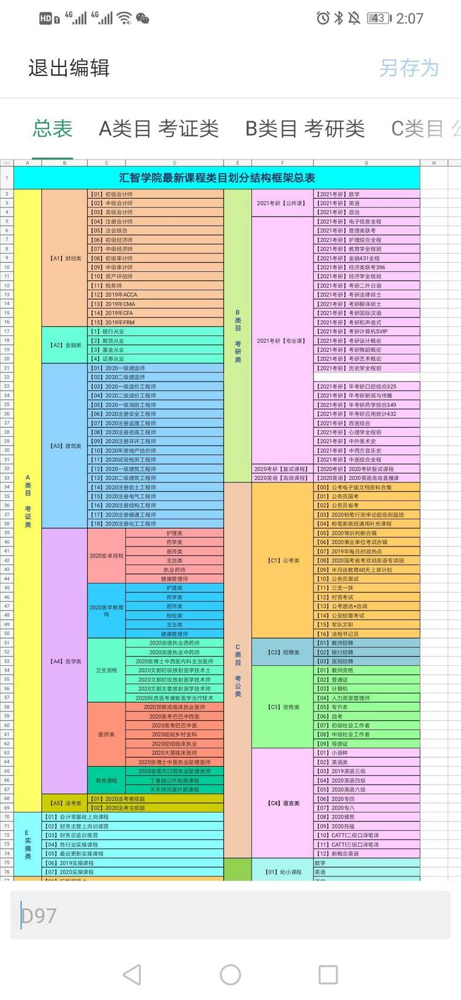

# 资源分类及收费标准

## 资源一：考研/考证/公考类 代更新

考研/考证/公考类 资源是每天都有专门团队负责更新，费用及操作流程参考 [2020年8月学习资料网云盘代更新](https://shimo.im/docs/pG0SAxiSvb8ofE7O/)

谢绝不完整的垃圾课程，为你省去大量时间。

## 资源二：学习资料库永久会员社群资源 259 元/年 （该资源稳定更新）

目录可以搜到的资源，有偿分享！支持试听试看，非诚勿扰！

学习资料库永久会员社群目录：[学习资料库永久会员社群目录](http://note.youdao.com/s/Ej0ZlPnw)

另外，目录中平台资源支持单个出售：69.9元/个。购买请参考[操作流程](https://shimo.im/docs/9UBe8LqvkxwMAwSq/read)

内容包含(不止于此)：

 

## 资源三：学习资料库合集 119 元/永久（价格随着内容增加而不断提升，早上车早优惠）

内容包含：（可单独购买）

[学习资料库自助购买平台](http://note.youdao.com/s/9G0sPeMo)

下列网站所有分类合集资源（除计算机培训类加密课程外），后续会不定期增加、更新。[购买链接](http://faka-pd.songqingbo.cn/buy/9 "购买链接")

网盘分类：

[学习资料库](http://faka-pd.songqingbo.cn/ "学习资料库")

## 资源四： 至尊课堂  109.9元/永久 

### [自助购买链接](http://faka-pd.songqingbo.cn/buy/10)

### 目录请移步[资源列表](./list/至尊课堂资源目录.md)

## 资源五：汇智学院资源 388元/永久 （原价520，涵盖资源一全部、资源三部分、资源四全部）

详细介绍参考：

## 资源六：学苑学社资源 498元/永久 （覆盖汇智学院资源，新增更加丰富稳定的资源内容）

# 售后服务

<b>

一、购买永久套餐资源可终身学习
</b>

不管你是学生，还是工作党

不管你是自用，还是兼职赚钱

资料团都是一个不错的选择。

一次加入，所有资料永久免费使用，持续更新。

资料团目前所有加密渠道，课程渠道，书籍渠道都已恢复完善，欢迎你的加入

<b>

二、免费代更新
</b>

所有资源都有专业团队负责整理更新，可放心使用。

<b>

三、代理资源
</b>

汇智学院资源允许自行使用，也可以有偿出售给他人，价格你定，收入全归你。

# 联系我们

我的微信：**LearnDatabase**

添加请备注：**获取付费资源**

否则不予以通过！！！

# 付费方式

<b>

支持类型
</b>

- 1. 微信支付

> 添加管理员好友转账
> 微信扫下面收款码进行微信支付（支持信用卡）

- 2. 支付宝支付（支持信用卡、花呗）

> 支付宝扫下面收款码付款，会有不定期优惠活动

